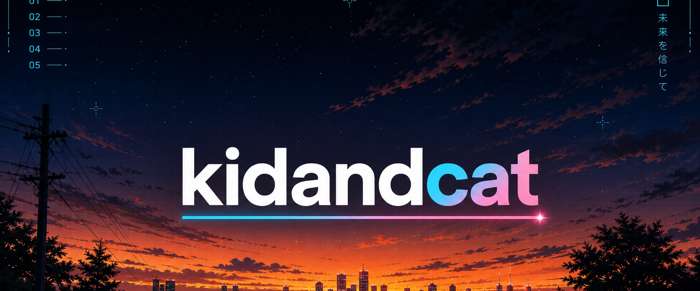

  

  

  <strong>Hairok</strong> · Jairo · <code>kidandcat</code> 
  <a href="https://kidandcat.com">kidandcat.com</a>
  ·
  <a href="https://x.com/kidandcat">x.com/kidandcat</a>

  Independent maker. 10+ years as a developer, designer, and architect. 
  I write <strong>Go</strong>. I make games, apps, and strange little things. 
  Curiosity first.

---

WORK

<table>
  <tr>
    <td width="50%" valign="top">
      <h3><a href="https://github.com/kidandcat/ccc">ccc</a></h3>
      Claude Code Companion. Control Claude Code from Telegram.
    </td>
    <td width="50%" valign="top">
      <h3><a href="https://github.com/kidandcat/takan">takan</a></h3>
      One MCP, modules for daily life.
    </td>
  </tr>
  <tr>
    <td width="50%" valign="top">
      <h3><a href="https://github.com/mentasystems/gox">gox</a></h3>
      Strict static analyzer for Go, aimed at LLM-written code.
    </td>
    <td width="50%" valign="top">
      <h3><a href="https://github.com/mentasystems/fragua">fragua</a> · <a href="https://mentasystems.github.io/fragua/">site</a></h3>
      AI-native PCB design.
    </td>
  </tr>
  <tr>
    <td width="50%" valign="top">
      <h3><a href="https://github.com/kidandcat/vocipher">vocipher</a> · <a href="https://vocipher.com">vocipher.com</a></h3>
      Voice chat and high-quality screen sharing.
    </td>
    <td width="50%" valign="top">
      <h3><a href="https://github.com/kidandcat/shot">shot</a> · <a href="https://kidandcat.github.io/shot/">site</a></h3>
      Screenshot → presentable image. Local CLI.
    </td>
  </tr>
</table>

STACK

  

  
  

  

<!-- Contribution snake: first successful run of .github/workflows/snake.yml publishes these SVGs to the `output` branch. -->

  <picture>
    <source media="(prefers-color-scheme: light)" srcset="https://raw.githubusercontent.com/kidandcat/kidandcat/output/github-contribution-grid-snake.svg">
    
  </picture>

ゆめのあいだ

